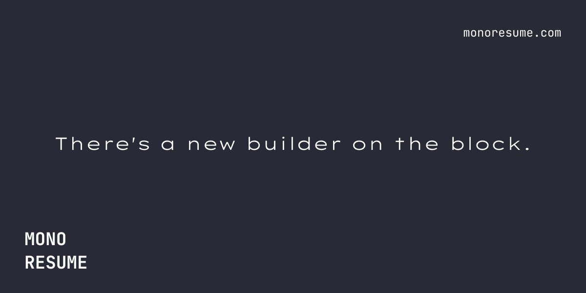

# Mono Resume



Mono Resume is a modern, minimalist resume builder designed for tech professionals. Built with Next.js, React, and TypeScript, this project offers a user-friendly interface for creating and customizing resumes with a unique code-inspired look.

[](https://opensource.org/licenses/MIT)

## Features

- Interactive form for inputting resume details
- Real-time preview of the resume
- Customizable sections (Overview, Education, Skills, Experience, etc.)
- PDF generation and download functionality
- Responsive design for various screen sizes
- Local storage to save resume data
- ATS-friendly resume template
- Monospace font styling for a code-like appearance

## Table of Contents

- [Features](#features)
- [Installation](#installation)
- [Usage](#usage)
- [Technologies Used](#technologies-used)
- [Contributing](#contributing)
- [License](#license)
- [Acknowledgements](#acknowledgements)

## Installation

1. Clone the repository:

   ```bash
   git clone https://github.com/ADITYANAIR01/mono-resume.git
   ```

2. Navigate to the project directory:

   ```bash
   cd mono-resume
   ```

3. Install dependencies:

   ```bash
   npm install
   ```

4. Run the development server:

   ```bash
   npm run dev
   ```

5. Open [http://localhost:3000](http://localhost:3000) in your browser

## Usage

1. Fill out the resume form with your personal information, education, skills, experience, and other relevant details.
2. Use the real-time preview to see how your resume looks.
3. Customize the visibility and order of different sections.
4. Generate and download your resume as a PDF.

## Technologies Used

- Next.js 14
- React 18
- TypeScript
- Tailwind CSS
- shadcn/ui components
- FontAwesome icons
- Radix UI primitives

## Contributing

We welcome contributions to Mono Resume! Please follow these steps to contribute:

1. Fork the repository
2. Create your feature branch: `git checkout -b feature/AmazingFeature`
3. Commit your changes: `git commit -m 'Add some AmazingFeature'`
4. Push to the branch: `git push origin feature/AmazingFeature`
5. Open a Pull Request

## License

This project is licensed under the MIT License. See the [LICENSE](LICENSE) file for details.

## Acknowledgements

- [shadcn/ui](https://ui.shadcn.com/) for UI components
- [Lucide](https://lucide.dev/) for icons
- [FontAwesome](https://fontawesome.com/) for additional icons
- [JetBrains Mono](https://www.jetbrains.com/lp/mono/) font for the code-like appearance
